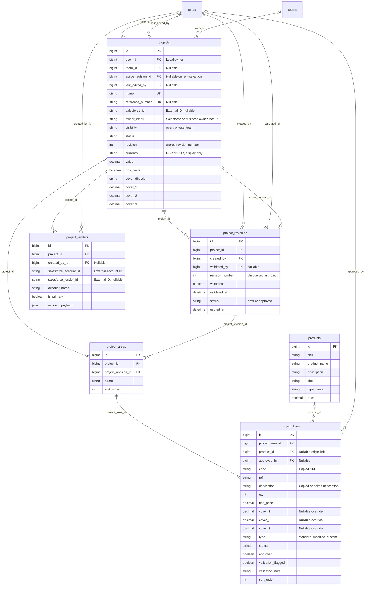
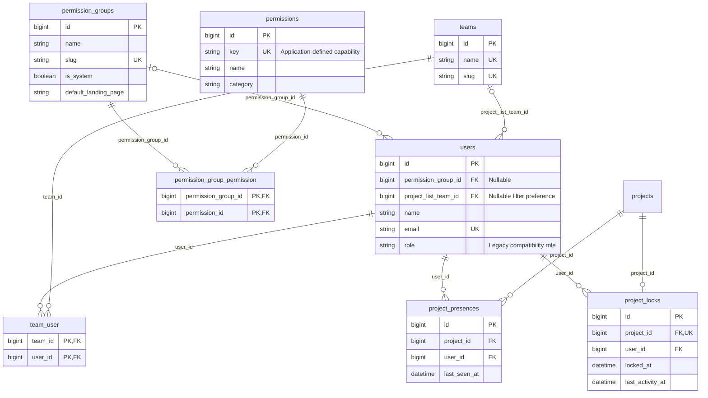
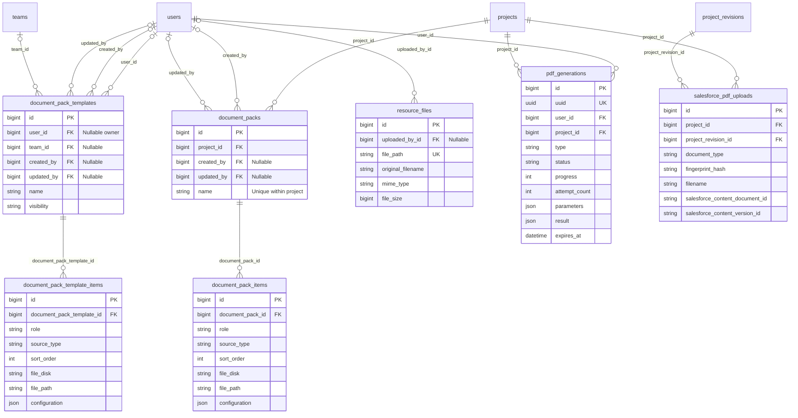
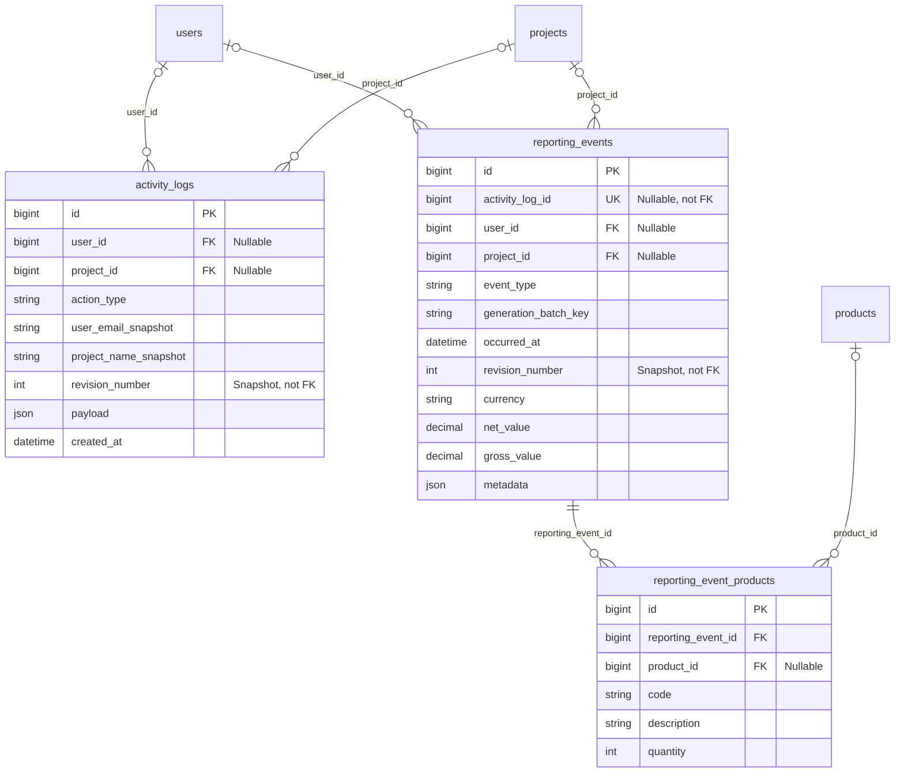

# LuxQuote database relationships

Based on the checked-in Eloquent models and migrations, reviewed 25 September 2026. This describes the schema defined by the repository; it has not been compared with a running database. Columns shown are selected keys and business fields, not an exhaustive column inventory. Standard timestamps are mostly omitted.

Read these Mermaid diagrams in a Markdown viewer with Mermaid support, such as GitHub. Table names match the database; Eloquent models normally use the singular PascalCase equivalent (`project_lines` → `ProjectLine`).

## Reading the diagrams

| Symbol | Meaning |
|---|---|
| `PK` | Primary key |
| `FK` | Database foreign key |
| `UK` | Unique key |
| `||` | Exactly one |
| `o|` / `|o` | Zero or one |
| `o{` / `}o` | Zero or many |

For example, `projects ||--o{ project_revisions` means a project can have many revisions, and every revision belongs to exactly one project. Cardinalities show database possibilities: the application normally creates an initial revision and area automatically. Line labels identify the foreign-key column. All connectors below represent database foreign keys; logical references without constraints are explained separately.

## 1. Projects, revisions and schedule lines

A project is the overall job. Each revision is a separate version of its schedule, containing its own areas and lines. For example, a project may have P1 and P2, each with its own Reception area and its own product quantities.

Important details:

- `projects.active_revision_id` selects the current revision. `projects.revision` stores its number, not its database ID. The FK alone does not ensure the selected revision belongs to that project; application guards enforce that. The diagram shows the physical FK's unconstrained reverse cardinality, not a business rule allowing shared active revisions.
- Areas store both `project_id` and `project_revision_id`. These are separate foreign keys: application code must ensure they refer to the same project. Lines reach their project and revision through their area.
- New revisions copy areas and lines. They start unvalidated, while existing line approval metadata is preserved during revision cloning. A revision becomes locked when its status is `approved`; validation alone does not lock it.
- A line can exist without a catalogue product. Its `code`, `description` and `unit_price` are stored on the line, rather than dynamically supplied by the product relationship. Deleting a product sets the origin link to null without deleting the line.
- Blank line Cover values inherit project defaults. Net prices and area totals are calculated by model methods/accessors, rather than represented by additional related tables.
- Tenders are project-level contractor links. `(project_id, salesforce_account_id)` is unique. Salesforce IDs are external references, not foreign keys to local Account or Opportunity tables.
- Local ownership is `projects.user_id`; `owner_email` and `owner_name` describe the business/Salesforce owner and are not user foreign keys.

## 2. Users, permissions, teams and editing presence

A user has at most one permission group but can belong to many teams. Groups determine capabilities; teams help determine which Team-visible projects and templates a user can access. Team membership does not grant application permissions.

The two join tables have composite primary keys, preventing duplicate memberships or permission assignments. `project_presences` instead has its own ID and a unique `(project_id, user_id)` pair. It records who is viewing a project. `project_locks` allows at most one editing-lock row per project; it is separate from the revision's approval lock.

## 3. Documents, templates and PDF processing

Document Packs belong to projects, not revisions. Generated items use the revision selected for generation. A pack's name is unique within its project.

Templates and Resources do not have direct foreign-key links to saved pack items. Static PDFs are copied into independent managed storage; applying a template creates independent pack contents. Generated Quote/Schedule entries retain configuration such as area selection and datasheet options.

`pdf_generations` records temporary processing status. Revision, tender and pack selections are carried in `parameters` JSON, not separate constrained FK columns. Laravel's `jobs` table holds the queued job payload; there is no direct FK between it and `pdf_generations`.

`salesforce_pdf_uploads` tracks a stable external document per `(project_id, project_revision_id, document_type)`, a unique combination. It stores external ContentDocument/ContentVersion IDs; it is not a local record of every historical Salesforce file version. PDF bytes live in file storage or Salesforce, not these database rows.

## 4. Activity history and durable statistics

Activity History is retained for three months by default. Reporting keeps independent snapshots so statistics can survive history pruning and deletion of referenced users, projects or products. Reporting events also store user, project and owner snapshot fields omitted from the diagram for space.

`reporting_events.activity_log_id` is a unique nullable source identifier with **no database foreign key**. Likewise, `revision_number` is a recorded number rather than a link to `project_revisions.id`. Product summaries are unique per `(reporting_event_id, code)`.

## Other tables

| Table | Purpose and relationship notes |
|---|---|
| `special_order_codes` | Standalone rules for codes such as NO OFFER. Matched by normalized code in application logic; no FK to project lines. |
| `app_settings` | Standalone key/JSON-value settings, including the Salesforce push switch and last catalogue import time. |
| `activity_log_archives` | Legacy compatibility storage. Its original-log, user and project IDs are not constrained FKs. No ongoing archive flow. |
| `sessions` | Laravel sessions; nullable indexed `user_id` is not a constrained FK. |
| `password_reset_tokens` | Reset tokens keyed by email; no constrained FK to users. |
| `jobs`, `job_batches`, `failed_jobs` | Laravel queue infrastructure. |
| `cache`, `cache_locks` | Laravel cache infrastructure. |
| `migrations` | Laravel's record of applied migrations. |

Salesforce Opportunities, Accounts and Visits calendar Events are external records, not local application tables.

## Eloquent navigation examples

These are existing model relationships, not extra database columns:

| Navigation | Meaning |
|---|---|
| `$project->revisions` | All revisions for the project |
| `$project->activeRevision` | Selected revision |
| `$project->activeRevision->areas` | Areas for that selected revision |
| `$area->lines` | Ordered schedule rows in an area |
| `$line->area->revision` | Revision containing a line |
| `$line->product` | Optional source catalogue product |
| `$user->permissionGroup->permissions` | Group capabilities, when a group is assigned |
| `$user->teams` | Team memberships through `team_user` |
| `$project->documentPacks` | Project-level document definitions |
| `$pack->items` | Ordered documents within a pack |
| `$reportingEvent->products` | Product snapshots for the event |

`$project->areas` includes areas across revisions. Editing screens must scope to the revision being viewed, which may differ from the active revision. Likewise, a schema FK does not imply an Eloquent method exists in both directions: for example, `reporting_event_products.product_id` has a database constraint but its model does not declare a `product()` relationship.

## Deletion behaviour worth understanding

| Parent removed | Database behaviour |
|---|---|
| Project | Cascades to revisions, areas, lines through areas, tenders, packs/items, presences, locks, PDF generations and Salesforce upload tracking. Activity/reporting links become null. |
| Revision | Cascades to its areas/lines and Salesforce upload tracking; any referencing active-revision pointer becomes null. |
| Product | Sets line and reporting-product origin links to null; copied values remain. |
| Pack or template | Cascades to its item rows. Physical file cleanup is handled separately by application code. |
| Permission group or team | Removes membership/permission pivot rows as applicable; nullable user/project/template references become null. |
| Reporting event | Cascades to its reporting-product rows. |

User references have mixed deletion rules: project ownership cascades, many audit/creator references become null, but `project_revisions.created_by` is required and has no cascading deletion rule. User deletion is therefore not universally a cascade or null operation and may be blocked by revision references. Application authorization and observer rules add further restrictions; this table describes database constraints, not permission to delete records.

Sources: [models](app/Models), [migrations](database/migrations), [permissions guide](PERMISSIONS.md), and [project status](PROJECT_STATUS.md).
