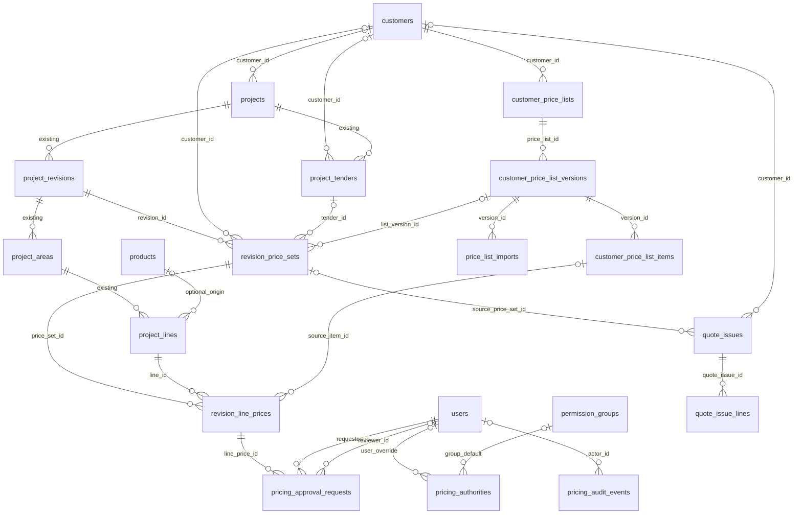

# Customer pricing, project prices and Cover — proposal

Design for review, 25 September 2026. No application code or database changes have been made. All customers, prices and limits in the mockups are illustrative.

Open [the interactive mockups](PRICING_MOCKUPS.html) in a browser. The proposed schema image and screen captures are in `storage/app/pricing-proposal-*`.

Review assets:

- [Proposed schema — PNG](storage/app/pricing-proposal-schema.png) · [SVG](storage/app/pricing-proposal-schema.svg)
- [Project pricing](storage/app/pricing-proposal-project.png) · [Apply an agreement](storage/app/pricing-proposal-apply.png)
- [Line discount / approval drawer](storage/app/pricing-proposal-discount.png) · [Previous quote prices](storage/app/pricing-proposal-history.png)
- [Customer price lists](storage/app/pricing-proposal-lists.png) · [CSV preview](storage/app/pricing-proposal-import.png)
- [Manager approval queue](storage/app/pricing-proposal-approvals.png) · [Group / user authority](storage/app/pricing-proposal-authority.png)

## Recommendation

Introduce a customer pricing layer between the trade catalogue and quote output. Keep the lighting schedule shared, but give each revision a separate price set for each pricing customer. This handles different tender contractors without copying the schedule or overwriting another customer's prices.

The four requested features then fit together:

| Request | Proposed experience |
|---|---|
| Agreed customer prices | A **Customer pricing** button selects a published list and previews matched parts, standard-price fallbacks and preserved overrides before applying. |
| Product discounts and user tolerances | An agreement item supports a fixed price or a percentage off trade. A line editor shows the user's additional-discount limit, the lowest permitted price and an approval route. |
| Previous prices and quantities | A **Price history** drawer shows successful historical quote snapshots for the same customer, part and currency, with quantity, date, project and revision. |
| Separate project price | Show read-only **Trade**, **Agreed/base** and editable **Project price** as distinct values. Customer-specific values live on revision line-price records. |

Assumptions for this first proposal: customer agreements describe **net prices**, and the pricing customer is normally the **selected tender contractor**. The customer selector also supports a project account or an explicitly linked local customer when there is no tender. These are decisions to confirm with the client, not inferred accounting rules.

## What the current app does

- `products.price` is the imported catalogue value; the API calls its source field `cost`, while validation calls it RRP. Confirm the commercial meaning before adopting the UI label **Trade** permanently.
- `project_lines.unit_price` is a copied/editable price, but its meaning depends on Cover direction. Deducted Cover treats it as Total; added Cover treats it as Net.
- Cover 1–3 compound sequentially. Two 5% levels mean 9.75% effective Cover, not 10%.
- Cover defaults and currency currently live on `projects`. Blank line Cover values inherit those mutable defaults, including when reading older revisions.
- Quote PDF rows currently use `totalUnitPriceForProject()`. Calling an agreed value “net” does not mean it can simply replace that field without changing output behaviour.
- The validator compares line price to today's catalogue RRP. Legitimate agreed prices would currently need mismatch approvals.
- Catalogue imports delete/reinsert product records, so product IDs are unsuitable as the only durable agreement key.
- Customer identity is largely descriptive text on a project, with Salesforce Account IDs available on tenders. Customer names alone are unsuitable for exact history matching.
- Existing reporting-product rows store code, description and quantity, but no historical per-product quoted unit price. Activity History is pruned, so it cannot be the permanent pricing audit.

Sources: `app/Models/ProjectLine.php`, `Project.php`, `app/Services/ProductImportService.php`, `ProjectRevisionValidator.php`, `ReportingEventService.php`, `resources/views/pdfs/schedule.blade.php` and the reporting migrations.

## Price definitions and calculation order

| Value | Meaning |
|---|---|
| Trade unit price | Catalogue reference captured at pricing time. Future imports do not silently change it. |
| Agreed/base net unit price | The authorized starting net price, resolved from the selected list or standard pricing. |
| Project unit price + input basis | The project-specific negotiated input, with an explicit `net` or `total` basis. The default new agreement workflow uses net. |
| Net unit price | The lower side of the existing Cover calculation, retained with its existing meaning pending client confirmation. |
| Total unit price | The higher side, currently printed as the quote unit price. Keep that output contract until a deliberate decision changes it. |
| Customer discount | A rule used to derive the agreement baseline from trade. It is not automatically another Cover level. |
| Additional discount | A discretionary reduction from the authorized base net price, checked against user authority. |
| Project value | Existing `projects.value`: overall commercial/Salesforce value, independent of line pricing. Do not reuse it as the new price field. |

Resolver order:

1. Resolve the selected customer, currency, revision, pricing date and published list version.
2. Match an exact normalized part code (trim and case-normalize; preserve meaningful internal characters). If codes are not globally unique, use an explicit catalogue namespace/site. Ambiguous matches are errors, not “take the first”.
3. For a fixed-net agreement use that amount. For a percentage rule calculate the baseline from the captured trade price. An unmatched part uses standard pricing with its configured Cover basis. Unknown/missing trade prices require a manual priced exception; they never become free by default.
4. Preserve an existing manual project override unless the operator explicitly chooses to replace it in the preview. No silent “lowest price wins”: a list may contain a higher price than the current project, and the preview must show that.
5. Evaluate any extra concession against the immutable authorized net baseline. Editing Cover, changing input basis, CSV import or entering a historical price goes through the same check.
6. Calculate and snapshot both Net and Total and the exact price printed on the quote. Run the same resolver for the editor, validation, approval, CSV, PDFs, Document Packs and queued jobs.

For Cover multiplier `m = (1-c1/100) × (1-c2/100) × (1-c3/100)`:

- Total-basis input: `net = project_unit_price × m`; `total = project_unit_price`.
- Net-basis input: `net = project_unit_price`; `total = project_unit_price ÷ m`.
- Cover off: Net and Total both equal the project price.

An agreed net price must not have Cover deducted from it again. With net £80 and Cover 5% + 5%, Net stays £80 and Total is £88.64. With Total £100 and those same Cover levels, Net is £90.25. These are different inputs with different outcomes. The client must confirm whether an agreement is a net figure, a gross/Total figure, or the customer-facing quoted figure; the proposed schema records the basis explicitly.

Use decimal arithmetic, with a documented penny-rounding policy shared across all outputs. Suggested policy: retain intermediate precision, round unit Net/Total to two decimals, multiply the displayed unit price by quantity and sum those line totals. Reject negative inputs, non-finite values, and Cover levels outside `0 <= c < 100`; zero prices need an explicit permitted reason. Test both GBP and EUR separately. The existing currency selector performs no FX conversion: an agreement currency mismatch must block application, not relabel money.

## Customer identity and multiple tenders

Add a local `customers` identity with a stable internal ID and optional unique Salesforce Account ID. Keep `projects.customer_name` as display/snapshot text, while adding nullable `projects.customer_id` and `project_tenders.customer_id`. Never automatically merge customers because their names match. Existing ambiguous names need an explicit mapping workflow.

Each revision gets one default price set and, as needed, a named customer/tender price set. A price set stores customer identity, currency, selected list version, Cover defaults, calculation version and its own commercial approval state. Technical areas/quantities stay shared.

If the client confirms that every project always has exactly one pricing customer, the UI can hide the price-set selector and use one set per revision. Keep the same separation in storage; it avoids changing the schema again if tender-specific pricing is introduced later.

For the same revision, Contractor A can have a £76 price and Contractor B £82 for the same line. Switching the selector changes the commercial view only. Quote output requires an explicit recipient-to-price-set mapping. Unpriced schedules remain common. A Quote item inside a Document Pack uses that recipient's approved set too.

A revision's structural approval and a price set's commercial approval are distinct. Schedule edits invalidate all affected commercial approvals. Editing one customer's prices invalidates that set; it does not approve or rewrite other customers' prices. Once the revision is approved, retain the current locking rule: changes require a new editable revision or the existing controlled unlock flow. A new revision copies pricing snapshots but must re-evaluate commercial authorization; do not carry an exception approval blindly into a changed context.

## Proposed schema

The image uses blue for existing areas being extended and green for new tables. This is a logical design: final lengths and migrations follow implementation review. IDs below are bigint unless noted; money uses DECIMAL, not float.

`pricing_audit_events` also contains logical subject references and immutable before/after snapshots. No misleading FK arrow is drawn to an arbitrary subject. Quote snapshots retain descriptive values if optional source links later disappear.

| New table | Main fields and constraints |
|---|---|
| `customers` | `id`, name, nullable unique `salesforce_account_id`, status, external reference. Archive rather than hard-delete referenced customers. |
| `customer_price_lists` | `id`, required customer FK, name, currency, archived_at. One selected list per set; no implicit stacking. |
| `customer_price_list_versions` | `id`, list FK, version number, draft/published/retired state, valid_from/to, `price_basis`, change reason, created/published actor and timestamps. Unique `(list_id, version_number)`; published contents immutable. Publication checks conflicting effective periods under a lock. |
| `customer_price_list_items` | `id`, version FK, normalized SKU/namespace, description snapshot, `rule_type` (fixed or percentage), nullable `fixed_unit_price`, nullable `discount_percent`, optional `max_extra_discount_percent`. Exactly one rule value required. Unique `(version_id, namespace, normalized_sku)`. Stable SKU is canonical; do not depend on catalogue IDs. |
| `price_list_imports` | `id`, draft version FK, actor, private source file/checksum, import mode, validation summary, status, created/completed times. Error report and row results can be private files; source retention separate from permanent audit. |
| `revision_price_sets` | `id`, revision FK, nullable customer/tender/list-version FKs, unique `(revision_id, context_key)` with non-null key, currency, pricing date, Cover enabled/direction/defaults, quote-price basis, calculation version, draft/pending/approved state, approval actor/time, optimistic lock counter. Default context uses a literal key, avoiding nullable-unique ambiguity. |
| `revision_line_prices` | `id`, price-set FK, line FK, nullable source-item FK; trade, base-net and project unit prices; explicit input basis; effective Cover 1–3; calculated Net/Total; price-source enum; manual-override flag/reason; provenance JSON; validation fingerprint. Unique `(price_set_id, line_id)`. Enforce same revision on every operation. |
| `pricing_authorities` | `id`, nullable permission-group FK, nullable user FK, max additional discount, max approval discount, effective dates, active state. Exactly one subject FK set. One active record per subject, enforced transactionally. A user override replaces its group limits; it never adds to them. |
| `pricing_approval_requests` | `id`, line-price FK, requester/reviewer FKs, proposed price/basis/Cover snapshot, effective discount, context fingerprint, reason, status, decision note, times. Approved exception applies only to the exact fingerprint; one open request per context. |
| `quote_issues` | `id`, unique issue UUID/idempotency key, nullable source price-set/project/revision/customer/tender/actor FKs, immutable customer/project/reference/revision snapshots, currency, output scope, quote-price basis, totals, rendered-document checksum, generation status/time, optional dispatch time. Successful generation means quoted/generated, not proof of delivery or acceptance. |
| `quote_issue_lines` | `id`, issue FK, nullable source-line FK, area/code/description snapshots, quantity, trade/base/project/Net/Total/printed-unit prices, Cover, source/provenance, ordinal. Unique `(issue_id, ordinal)`; index normalized SKU. Different areas or price points remain separate rows. |
| `pricing_audit_events` | `id`, actor FK nullable plus actor snapshot, event type, logical subject type/ID, customer/project context snapshots, before/after JSON, reason, correlation/import/request IDs, timestamp. Append-only through application; no routine three-month history prune. |

Existing tables affected:

| Table | Change |
|---|---|
| `projects`, `project_tenders` | Add nullable customer links; retain descriptive fields and Salesforce IDs. |
| `project_revisions`, `project_lines` | Add relationships to price sets/line prices. Keep legacy prices during transition; do not turn `unit_price` into a second editable source of truth. |
| `products` | No customer-price column. Remains the shared trade catalogue. Stable matching rules must be established. |
| `permissions`, permission pivots | Add fixed capabilities through `PermissionKey` and forward migrations; update defaults and permission tests. |
| `pdf_generations` | Include price-set ID, issue ID and snapshot fingerprint in parameters; generate from the submitted immutable payload. No live repricing in the worker. |
| `salesforce_pdf_uploads` | Extend tracking identity to recipient/customer context (non-null context key) so two tender customers do not accidentally replace one another's external document chain. Review filename/version policy with the client. |
| `reporting_events`, `reporting_event_products` | Consume successful issue snapshots for commercial statistics, with explicit recipient/batch deduplication semantics. Avoid summing competing tender quotations as independent won revenue. |
| `activity_logs` | May mirror pricing events for familiar History navigation; not the durable source. |

History indexes: `quote_issues(customer_id, currency, generated_at)`, `quote_issue_lines(normalized_sku, quote_issue_id)`, and source-project/visibility lookup indexes. Paginate/filter in SQL. Agreement lookup uses the unique version/namespace/SKU key. Archive published lists instead of deleting them; historical quote snapshot rows must not cascade away with deleted source projects or products. Use nullable source FKs plus immutable snapshots and retain visibility scope snapshots so deletion never makes private history public.

The quote issue scope snapshot should include project visibility, owner identity and team identity. While the project exists, use its current visibility policy; after deletion, apply the retained policy conservatively with current team membership. If an identity or team can no longer be resolved, deny ordinary access rather than widening it. Link the issue to the authenticated request owner for prepared downloads separately from history authorization.

## Authority and approval rules

Start with additional discount measured against the authorized **base net** price. This makes the rule consistent whether a user edits a net amount, total amount or Cover percentage. Do not measure repeatedly against the last edited price: that would allow several small discounts to bypass a limit.

Example: Trade £100; published customer net £80; Sales allowance 5% extra. The lowest self-approved net is £76. A £72 request is 10% extra and needs an authorized reviewer. The overall discount from trade is 28%, displayed as context rather than confused with the 10% extra concession.

Suggested illustrative defaults: Sales 5% extra, Manager 15%, individual override 3% where required. Missing authority means 0% discretionary reduction, not unlimited. If the agreement item caps further reduction at 4%, the effective allowance is the lower of 4% and the user's limit. Approving beyond an agreement cap requires an explicit agreement change, not an ordinary exception button. A reviewer needs approval permission and sufficient approval authority; no self-approval. Any cost/margin floor is a later rule requiring reliable cost data—the current imported `cost` name is not sufficient evidence of cost of sale.

An out-of-limit proposal is saved as a pending request while the currently effective price remains unchanged. The price set is blocked from quote generation until the request is approved, rejected or withdrawn. Approval rechecks the revision lock, project/customer ownership, current actor authority, line quantity/code, list version, currency and pricing fingerprint transactionally. Changed inputs mark requests stale. Approved customer lists are themselves pre-authorized baselines; applying one is not a fresh discretionary discount request.

Technical validation still checks SKU, duplicates and manual flags. Commercial validation replaces blanket RRP mismatch with source/basis/authority checks. A valid published agreement is not a price error. Technical line approval cannot bypass a commercial exception. Quote generation requires both the existing approved revision and an approved selected price set.

## Permissions

All monetary UI, JSON responses, exports, history, audit and imports remain gated by `pricing.view`. Mutations additionally require `pricing.update` and applicable project access/editability checks; Cover changes require `cover.update`. Numeric tolerances are data, not dynamically invented permission keys.

| Capability | Proposed default / purpose |
|---|---|
| Existing `pricing.view`, `pricing.update`, `cover.update` | Retain current defaults; enforce in every new path. |
| New `customer-prices.view` | Admin, Manager, Sales: see lists within authorized customer scope. |
| New `customer-prices.apply` | Admin, Manager, Sales: apply a published list to an accessible editable project. Requires price view/update. |
| New `customer-prices.manage` | Admin, Manager: create/edit draft agreements and upload CSVs. No authority to publish by itself. |
| New `customer-prices.publish` | Admin initially: approve/publish or retire agreement versions; separate from drafting. |
| New `pricing.history.view` | Admin, Manager, Sales: history only from projects already visible to the user. |
| New `pricing.exceptions.approve` | Admin, Manager: decide exceptions within their configured approval limit. |
| New `pricing.authority.manage` | Admin: set numeric limits; cannot delegate implicitly through price-list editing. |
| New `pricing.audit.view` | Admin, Manager: durable pricing audit within permitted scope. |

A price-list permission does not grant access to every customer by accident: initial policy can be organization-wide lists for these commercial roles, explicitly confirmed at rollout. Restricted agreements would require customer/team assignments and a further visibility policy. Do not infer those rights from a customer name or Salesforce search availability. An extra cross-project history permission is deliberately deferred; the initial history view respects Open/Private/Team access, including after source deletion via retained scope metadata.

## UI proposal

Use the supplied existing UI as the visual reference: collapsed icon rail, compact top bar, Edit / Validation / Output / Project History navigation, project-header actions, Qty / Line Items / Project Total cards and dense area rows. Add **Customer pricing** beside the existing project actions. No separate Pricing tab or expanded commercial sidebar is proposed. The revised mockups retain illustrative data so the reference screenshot's real project is not presented with invented commercial values.

1. **Project pricing:** keep the existing summary cards and area header totals. Add a compact context line for the selected customer, pinned agreement, currency, input basis, Cover and pricing-review status. Put read-only Trade beside editable Project Price in the existing schedule grid; retain Code, Ref, Description, Qty, Type, Notes, Status and row actions. Agreement details and calculation breakdown live in the price drawer. The mock shows short pricing-source hints in otherwise empty Notes cells; in implementation, existing user notes must take precedence and pricing hints can move into a tooltip. The row's Status remains technical approval, distinct from commercial approval. Customer selection is inside the Customer pricing modal. Use the existing Net/Total presentation when Cover is enabled.
2. **Apply a list:** a modal lists eligible published versions for the selected customer/currency. Preview matched, fallback, invalid and protected-manual rows with before/after prices and total effect. Default to preserving manual prices. Applying is explicit and atomic; concurrent schedule/list changes require a new preview. An expired or incompatible list cannot be selected. A newly published version only offers **Review update**; it never silently reprices a project.
3. **Line pricing drawer:** show calculation source, trade/base/project prices, authority floor, Cover basis and Price history. Users may type a price or extra-discount percentage; both update the same canonical value. Within-limit changes offer Save; out-of-limit changes offer Request approval with a mandatory reason. The mock has a live calculator for this distinction.
4. **Customer price lists:** Admin navigation entry with Customer, Currency, Version, Validity, Status and Part count. A detail page has Items, Versions and Audit tabs. Editing a published agreement creates a new draft version. Fixed amount and trade-discount rules are explicit per item; mixed net/total bases within one version are excluded initially.
5. **CSV wizard:** Upload → map columns → validate/preview → create draft → publish with permission. Show insert/change/remove counts, line-level errors and an auditable reason. No partial live publication. Merge mode retains absent items; replace mode explicitly previews removed items. CSV columns: `sku, namespace, rule_type, fixed_unit_price, discount_percent, max_extra_discount_percent`; customer, currency, price basis and validity are selected on the version form. Reject duplicates, ambiguous SKUs, invalid numeric ranges and conflicting rules; report unknown SKUs for correction rather than silently dropping them. Same-file retry is idempotent. Sanitize spreadsheet formula-leading cells in exported CSVs. A genuine streaming/staged importer is needed for large files; do not feed rows directly into a published list.
6. **Customer price history:** open a wide modal from Previous prices or the small clock beside a line price, leaving the schedule visible behind it. Use the same customer/currency by default, newest successful quotes first; filters for code, date, project and quantities. Show Net and quoted/Total explicitly, quantity, Cover, date, revision and source. “Use as project price” opens a preview and reruns today's authority checks. A historic quantity is context, not a volume-price entitlement. Empty history says “No captured quotes yet”; legacy current schedule prices are not presented as proof of old quoted prices. The top Project History link keeps its existing activity-history meaning; customer price history has separate entry points beside pricing.
7. **Approvals and limits:** a manager queue shows proposed discount, existing price, quantity, overall effect, reason and history. An Admin authority page edits group defaults and user overrides, with before/after audit. Any extra-discount cap must apply equally to UI, imports and forged requests.

For small screens use horizontally scrollable schedule tables and full-width drawers; keep Code, Qty and Project price visible first. Include explicit labels, keyboard focus, Escape/close behaviour and validation text, not colour alone. Match the existing Filament action model. Filament 5 supports [slide-over modals and wizards](https://filamentphp.com/docs/5.x/actions/modals) and [CSV import actions](https://filamentphp.com/docs/5.x/actions/import); the agreement staging/publication behaviour would be application logic around those components.

## Quote history and audit lifecycle

At submission, capture the exact approved price-set version, recipient, quantities, selected areas and prices into an immutable issue payload. The PDF worker reads that payload, not a mutable catalogue or current project defaults. Queued retries reuse the same idempotency key; only a successful render marks the issue generated and contributes to price history. Failure remains visible as failure. Delivery to Salesforce is a separate status, not proof of customer acceptance.

Regenerate an old quote from its snapshot to reproduce its commercial values. Repricing at current rates is a distinct action creating a new draft and eventually a new issue. Preserve both real-world customer identity and display-name snapshots. Exact PDF reproduction also requires retained template/assets or the original file; a price snapshot alone guarantees commercial values, not byte-for-byte output.

Pricing audit records include who, when, customer, project/revision, old/new values, reason, source file/version and approval decision. Include publishes, retirement, manual edits, list application, authority changes, imports, historical-price reuse and quote issue. Store the audit in the same transaction as the mutation; if that write fails, the pricing change fails. These records are independent of three-month Activity History retention. Agree retention and access rules with the business; do not call application append-only storage tamper-proof against a database administrator.

## Implementation sequence

1. **Confirm the money definitions and customer identity.** Decide agreement basis, recipient, quote-facing price and authority baseline. Agree examples covering both Cover directions and mixed tender customers.
2. **Introduce price sets and migration compatibility.** Add nullable links/new tables with forward migrations; preserve all existing numeric values. Existing lines run a `legacy` calculation path initially. Backfill new sets from stored values and current known Cover context with a provenance flag; do not claim to reconstruct historical prices where past defaults were not captured. Historical approved revisions are never silently repriced. Validate old/new output parity before enabling the new editor.
3. **Deliver agreements and the project editor.** Customer mapping, draft/published list versions, match preview, fixed-net and percentage rules, fallback, separate project price, protected overrides, CSV staging and permanent audit.
4. **Deliver authority and review together.** Server-enforced limits, scoped exception requests and commercial validation must ship before discretionary discounts are opened to users.
5. **Start immutable quote capture at launch.** History becomes useful as quotes are generated. Import old quote data only where the exact customer, currency, prices and quantities are verifiable; label provenance. Build history lookup and reuse from the same snapshots.

Do not deploy schema alone and immediately switch every price reader. Inventory schedule editing, product/paste imports, line cloning, validation, PDFs/CSV, Document Packs, queued generation, Salesforce Amount/upload tracking, Statistics and History. Keep one resolver and feature-controlled rollout. Permission catalogue/default documentation and focused tests change with implementation. No dependency change is proposed.

Acceptance coverage should include: full/partial/no SKU match; duplicate/unknown codes; expired/future/wrong-currency lists; catalogue replacement; zero/missing prices; both Cover directions and compounded rounding; protected overrides; two customer prices on one revision; repeated edits unable to compound past authority; stale/self/cross-project approval; locked revisions; per-recipient PDF/pack/CSV output; queue retries/concurrent edits; immutable historical prices; deleted source records; non-pricing users; failed/duplicate/replace CSV imports; complete audit rollback; and parity for legacy quotes.

## Decisions for the client

1. Does “agreed price” mean Net, existing quote Total, or another customer-facing amount? Should Cover be shown on the quote, internal only, or part of the negotiated price?
2. Is the pricing customer the tender contractor, the Opportunity account, or a separately selected trading account? Can two contractors need different prices on the same revision?
3. Are user limits measured as an additional concession from an agreement, a total trade discount, a minimum net amount, or margin? This proposal starts with additional net concession; numbers in the mockups are examples.
4. Does “project price field” mean per-product project unit price (proposed) or an independently negotiated lump-sum total? A lump sum needs a separate allocation/reconciliation design; it should not overwrite `projects.value` or silently disagree with line totals.
5. Are quantity breaks required now, or is quantity only context in price history? This proposal uses one rule per customer/part/version, with quantity breaks deferred.
6. Who can publish agreements, how long are they valid, and how long should pricing audit and quote snapshots be retained? Is general organization-wide agreement visibility acceptable for permitted commercial roles?

Recommended first release: customer identities, versioned agreements, separate project prices, bounded discounts with approval, quote snapshots and history, with CSV and durable audit included. Defer overlapping price-list priorities, volume tiers, multi-currency conversion and cost/margin rules until those requirements are explicit.
